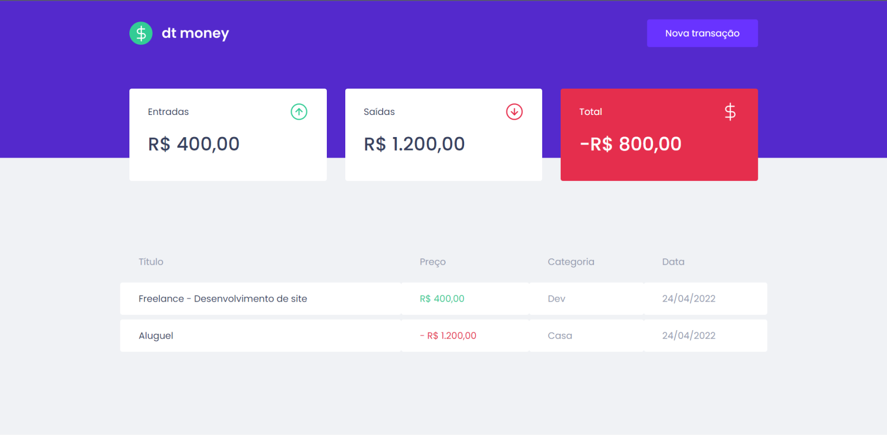
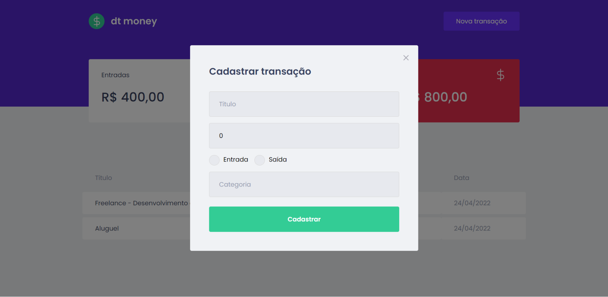
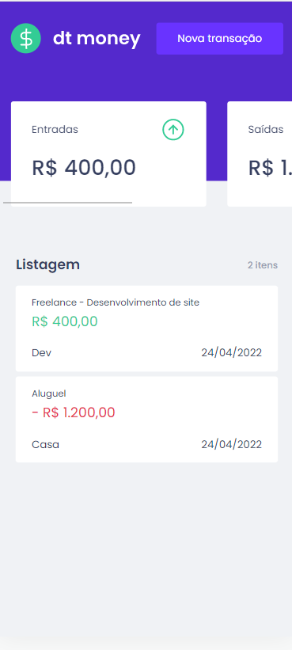
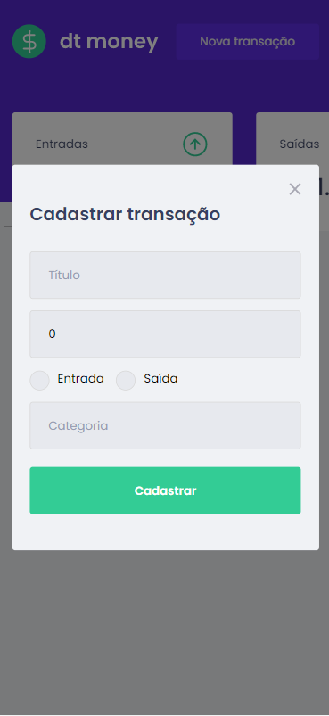

# dt money 💰

The dt money is a web app that allows you to register and view your financial transactions

This project was created following the project of [Ignite](https://www.rocketseat.com.br/ignite) from [Rocketseat](https://www.rocketseat.com.br/)

## Techs

- [React](https://reactjs.org)
- [Node.js](https://nodejs.org/en/)
- [Typescript](https://www.typescriptlang.org/)
- [Styled components](https://styled-components.com/)
- [Mirage JS](https://miragejs.com/)

## Screens

#### Desktop

#### Mobile

<h1 align="center">

</h1>

## Running the project

### `yarn dev`

Runs the app in the development mode.\
Open [http://localhost:3000](http://localhost:3000) to view it in the browser.

The page will reload if you make edits.\
You will also see any lint errors in the console.
